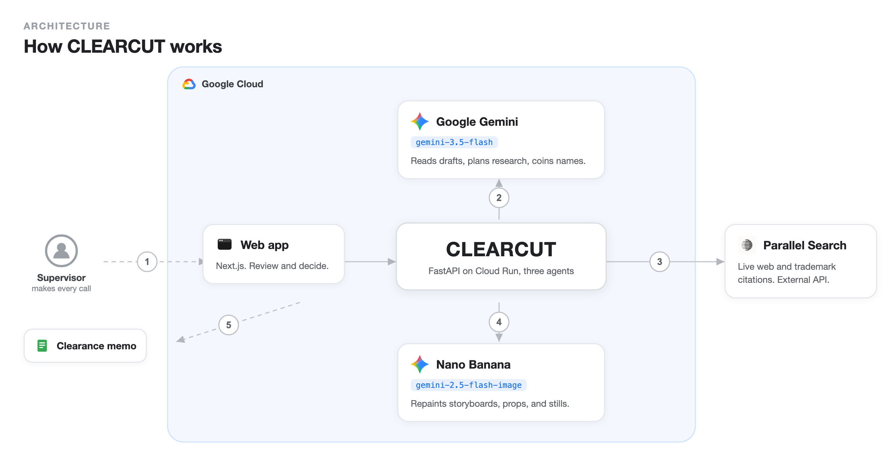
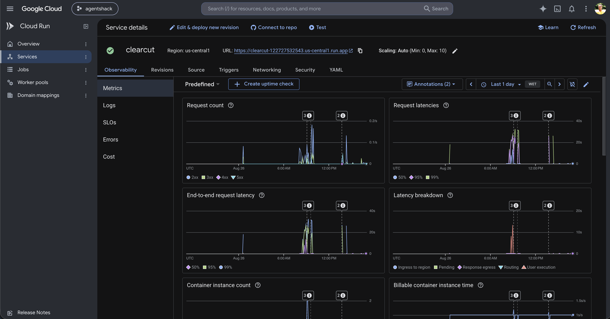
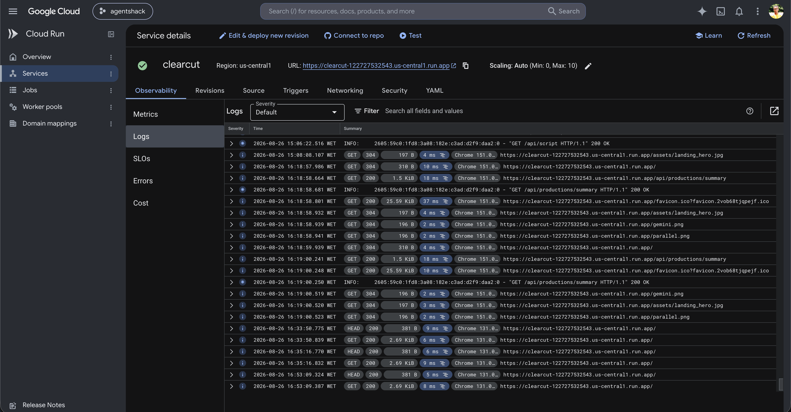
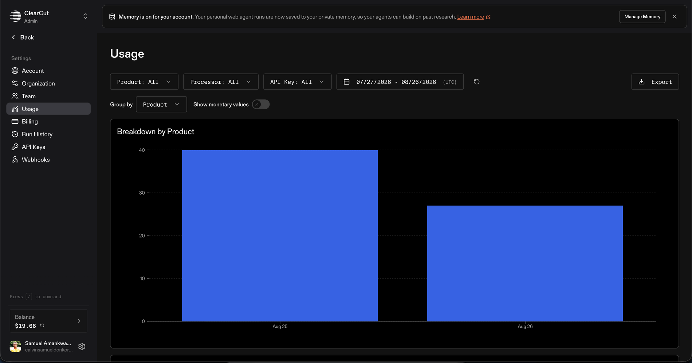
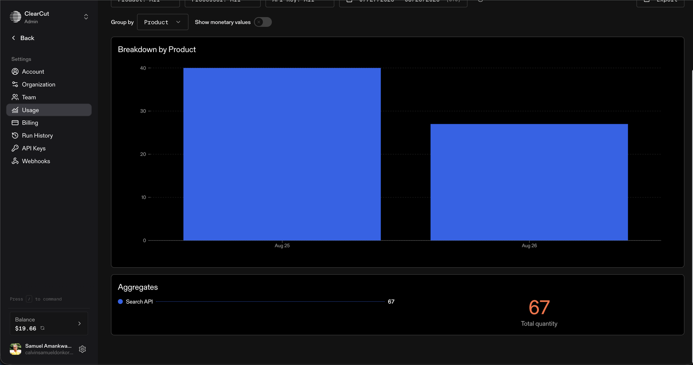

# CLEARCUT 🎬

**CLEARCUT keeps a film's rights clearances in step with its script. When the script changes, it tells you which earlier clearance decisions no longer hold.**

[](https://ai.google.dev)
[](https://cloud.google.com/run)
[](https://parallel.ai)
[](https://fastapi.tiangolo.com)
[](https://nextjs.org)
[](https://pytest.org)
[](LICENSE)

> Built for Agentic Cinema: The Blockbuster Hackathon (Parallel track).

**Video demo:** https://youtu.be/PZrUgO_BWec

---

## What it does

A film script changes many times before it is shot. Each new draft can undo a rights decision that was made on an earlier one. Usually nobody catches it until the old brand is already in a storyboard, on a prop, or in a shot you have filmed.

CLEARCUT compares each new draft to the last one and shows only the changes that affect rights. For each one, it runs a live web and trademark search so you decide on current facts, not memory. It does not clear anything by itself. It does the legwork, and you make the call.

---

## How it works

<p align="center">
  
</p>

The numbers on the diagram follow one draft through the system:

1. The supervisor drops a new script draft into the web app.
2. Gemini reads it against the last draft and keeps only the changes that affect rights. A fictional name swapped for a real one reopens the decision that assumed it was fictional, and Gemini coins a new name when one is needed. *"19 changes. Only 3 affect clearance."*
3. Parallel Search checks each flagged brand, and any new name, against the live web and trademark records.
4. Nano Banana repaints storyboards, props, and stills that still show the old brand.
5. CLEARCUT writes the clearance memo, and the supervisor signs off.

---

## Quickstart

You need Node 18+ and Python 3.10+.

**1. Add your keys.**
```bash
cp backend/.env.example backend/.env
```
Then fill in `backend/.env`:
```ini
PARALLEL_API_KEY=your_parallel_key
PARALLEL_MODE=advanced
GEMINI_API_KEY=your_gemini_key
GEMINI_MODEL=gemini-3.5-flash
```

**2. Set up the backend once.**
```bash
cd backend && python -m venv venv && venv/bin/pip install -r requirements.txt && cd ..
```

**3. Start everything.**
```bash
./run.sh
```
Web app on http://localhost:3000, API on http://localhost:8000 (docs at `/docs`).

---

## Tests

```bash
cd backend && PYTHONPATH=. venv/bin/pytest tests/test_flow.py -v
```

---

## What it is built with

- **Web app:** Next.js, React, TypeScript, Tailwind. Four screens: Report, Script, Review, Storyboard.
- **Backend:** FastAPI and Python. A clearance state machine and three tool-using agents that read the draft, research, and resolve.
- **AI:** Google Gemini (`gemini-3.5-flash`) reads drafts, plans research, and coins names. Nano Banana (`gemini-2.5-flash-image`) draws storyboards and repaints assets.
- **Grounding:** the Parallel Search API for live web and trademark citations.

---

## Proof of a real run

CLEARCUT runs live on Google Cloud (Cloud Run) and calls the Parallel Search API for real.

**Google Cloud: the `clearcut` service on Cloud Run, with live traffic**





**Parallel Search API: real usage, 67 search calls**





---

## Note

CLEARCUT helps with clearance research and tracking. It is not legal advice and does not replace qualified entertainment counsel.

---

## License

MIT. See [LICENSE](LICENSE).
